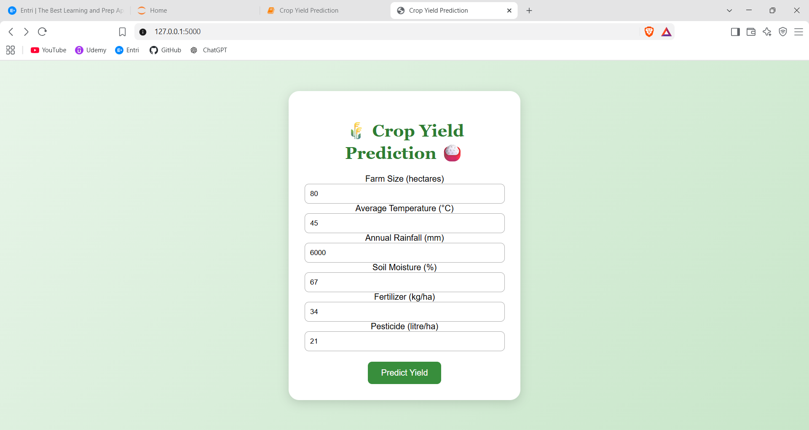
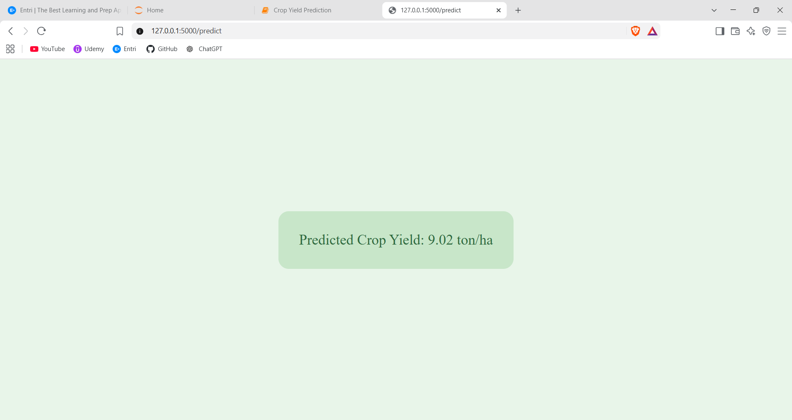

# Crop Yield Prediction Using Machine Learning

### End-to-End Machine Learning Project Report

---

## 1. Project Overview & Importance

Agriculture is one of the most important sectors for food security and economic development. Predicting crop yield accurately can help farmers, agricultural organizations, and decision-makers plan resources and improve agricultural productivity.

Crop yield is influenced by several factors, including weather conditions, soil characteristics, irrigation, fertilizer usage, pesticide usage, crop type, farming practices, and modern agricultural technologies.

This project develops a machine learning-based **Crop Yield Prediction System** that predicts the expected crop yield in tons per hectare. Instead of depending only on traditional estimation methods, the system learns patterns from historical agricultural and environmental data.

The prediction system can help in:

- Estimating expected crop production.
- Supporting better agricultural planning.
- Improving resource allocation.
- Understanding the effect of environmental factors.
- Helping farmers make data-driven decisions.
- Supporting sustainable agricultural practices.

---

## 2. Dataset Overview

The project uses the **Modern Agriculture AI Crop Production Dataset (2020–2050)** containing approximately **75,000 records and 36 features**.

The dataset contains information related to agricultural, environmental, and technological factors.

### Major Dataset Attributes:

- **Time Information:** Year
- **Geographical Information:** Region and Country
- **Crop Information:** Crop type
- **Farm Information:** Farm size and farm type
- **Soil Information:** Soil type and soil characteristics
- **Irrigation:** Irrigation type
- **Agricultural Inputs:** Fertilizer, pesticide, and water usage
- **Weather Factors:** Average temperature and annual rainfall
- **Environmental Factors:** Soil moisture and climate stress
- **Agricultural Risks:** Disease risk and pest risk
- **Technology:** AI system usage and other technology-related factors
- **Target Variable:** `yield_ton_per_ha`

The target variable represents crop yield measured in **tons per hectare (ton/ha)**.

---

## 3. Exploratory Data Analysis (EDA) & Key Findings

Before developing the machine learning models, exploratory data analysis was performed to understand the structure and behavior of the dataset.

### 1. Target Variable Distribution

The distribution of `yield_ton_per_ha` was analyzed to understand the typical crop yield values and identify unusual observations.

### 2. Missing Value Analysis

The dataset was checked for missing values in all columns. Missing values were handled appropriately before model training.

### 3. Categorical Feature Analysis

Categorical variables such as crop, region, country, soil type, irrigation type, and farm type were analyzed to understand their distributions.

### 4. Correlation Analysis

Correlation analysis was used to identify relationships between numerical agricultural and environmental variables and crop yield.

### 5. Outlier Analysis

Boxplots and statistical methods were used to identify extreme values in numerical variables.

EDA helped identify important factors that may influence crop yield and guided the subsequent preprocessing and feature engineering stages.

---

## 4. Data Preprocessing & Feature Engineering

Raw agricultural data cannot be directly supplied to most machine learning algorithms. Therefore, several preprocessing steps were performed.

### Missing Value Handling

Missing values were identified using appropriate data analysis techniques. The missing values in `ai_system_used` were handled by replacing them with **`Unknown`**.

### Duplicate and Unnecessary Feature Handling

Duplicate records were checked and unnecessary identifiers or outcome-related columns were removed where appropriate.

Columns such as:

- `record_id`
- `production_tons`
- `revenue_usd`
- `profit_usd`
- `recommended_action`

were excluded when they were not required for predicting crop yield or could introduce information that would not be available during prediction.

### Categorical Encoding

Machine learning algorithms require numerical input. Categorical variables were converted into numerical form using **One-Hot Encoding**.

Important categorical variables include:

- Crop
- Region
- Country
- Soil Type
- Irrigation Type
- Farm Type
- AI System Used

### Feature Selection

Feature selection was performed to identify the most useful variables for crop yield prediction.

Feature importance and statistical feature-selection techniques can be used to determine which agricultural and environmental factors contribute most strongly to the prediction.

### Feature Scaling

Numerical features were scaled using **StandardScaler** where required.

Scaling is particularly important for algorithms such as:

- MLP Regressor
- KNN Regressor

### Train-Test Split

The dataset was divided into:

- **80% Training Data**
- **20% Testing Data**

A `random_state` of 42 was used to make the split reproducible.

---

## 5. Machine Learning Model Training

The processed dataset was used to train and compare multiple regression algorithms.

Five regression algorithms were selected for the project.

### 1. Linear Regression

Linear Regression was used as a baseline regression model.

It attempts to establish a linear relationship between the input agricultural features and crop yield.

### 2. Decision Tree Regressor

Decision Tree Regressor predicts crop yield by creating a series of decision rules based on the input features.

It can capture non-linear relationships between agricultural conditions and crop yield.

### 3. Random Forest Regressor

Random Forest Regressor combines multiple decision trees to produce a more reliable prediction.

It can handle complex relationships between variables such as rainfall, temperature, fertilizer usage, soil conditions, and crop type.

### 4. MLP Regressor

MLP (Multi-Layer Perceptron) Regressor is a neural-network-based regression algorithm.

It can learn complex non-linear relationships between agricultural input features and crop yield.

### 5. KNN Regressor

KNN (K-Nearest Neighbors) Regressor predicts the yield of a new sample by considering the yield values of similar observations in the training dataset.

Feature scaling is important for KNN because it is based on distance calculations.

---

## 6. Model Evaluation

The trained regression models were evaluated using four standard regression metrics.

### Mean Absolute Error (MAE)

MAE calculates the average absolute difference between actual and predicted crop yield.

A lower MAE indicates better performance.

### Mean Squared Error (MSE)

MSE calculates the average squared difference between actual and predicted values.

A lower MSE indicates better performance.

### Root Mean Squared Error (RMSE)

RMSE is the square root of MSE.

It represents the prediction error in the same unit as the target variable.

A lower RMSE indicates better performance.

### R² Score

R² measures how well the model explains the variation in crop yield.

A higher R² score indicates better predictive performance.

The models are compared using:

| Model                   | MAE | MSE | RMSE |  R² |
| ----------------------- | --: | --: | ---: | --: |
| Linear Regression       |   — |   — |    — |   — |
| Decision Tree Regressor |   — |   — |    — |   — |
| Random Forest Regressor |   — |   — |    — |   — |
| MLP Regressor           |   — |   — |    — |   — |
| KNN Regressor           |   — |   — |    — |   — |

The final values are filled after running the models on the dataset.

---

## 7. Model Comparison & Selection

The performance of all five regression algorithms is compared using MAE, MSE, RMSE, and R².

The model with:

- Lower MAE
- Lower MSE
- Lower RMSE
- Higher R²

is considered the better-performing model for the crop yield prediction task.

Random Forest, Decision Tree, Linear Regression, MLP, and KNN provide different approaches to learning the relationship between agricultural conditions and crop yield.

The final model will be selected based on its performance on the unseen test dataset.

---

## 8. Prediction Workflow

The complete machine learning workflow consists of the following stages:

**Raw Agricultural Dataset**

↓

**Data Cleaning**

↓

**Missing Value Handling**

↓

**EDA**

↓

**Outlier Analysis**

↓

**Categorical Encoding**

↓

**Feature Selection**

↓

**Train-Test Split**

↓

**Feature Scaling**

↓

**Model Training**

↓

**Model Evaluation**

↓

**Best Model Selection**

↓

**Crop Yield Prediction**

The trained model can then receive new agricultural conditions and predict the expected crop yield in **tons per hectare**.

---

## 9. Conclusion & Key Takeaways

This project demonstrates how machine learning can be applied to predict crop yield using agricultural, environmental, and technological factors.

The dataset contains multiple variables that can influence crop productivity, making machine learning suitable for identifying complex relationships within the data.

The project compares five regression algorithms:

1. Linear Regression
2. Decision Tree Regressor
3. Random Forest Regressor
4. MLP Regressor
5. KNN Regressor

The models are evaluated using MAE, MSE, RMSE, and R² score.

The final selected model can be used to estimate crop yield based on agricultural and environmental conditions. Such a system can support data-driven agricultural planning, resource management, and productivity improvement.

---

## 10. Project Technologies

### Programming Language

- Python

### Libraries

- Pandas
- NumPy
- Matplotlib
- Seaborn
- Scikit-learn

### Machine Learning

- Linear Regression
- Decision Tree Regressor
- Random Forest Regressor
- MLP Regressor
- KNN Regressor

### Evaluation Metrics

- MAE
- MSE
- RMSE
- R² Score

---

## 11. Expected Project Output

The system accepts agricultural and environmental information as input and produces a predicted crop yield.

### Example:

**Input:**

- Crop type
- Region
- Soil type
- Irrigation type
- Temperature
- Rainfall
- Soil moisture
- Fertilizer usage
- Pesticide usage
- Other relevant agricultural factors

**Output:**

**Predicted Crop Yield: XX.XX ton/ha**

This prediction provides an estimated crop yield based on the learned patterns in the historical dataset.

### Crop Yield Prediction Interface / Output

Below is an example execution showing the input features and final predicted crop yield:

